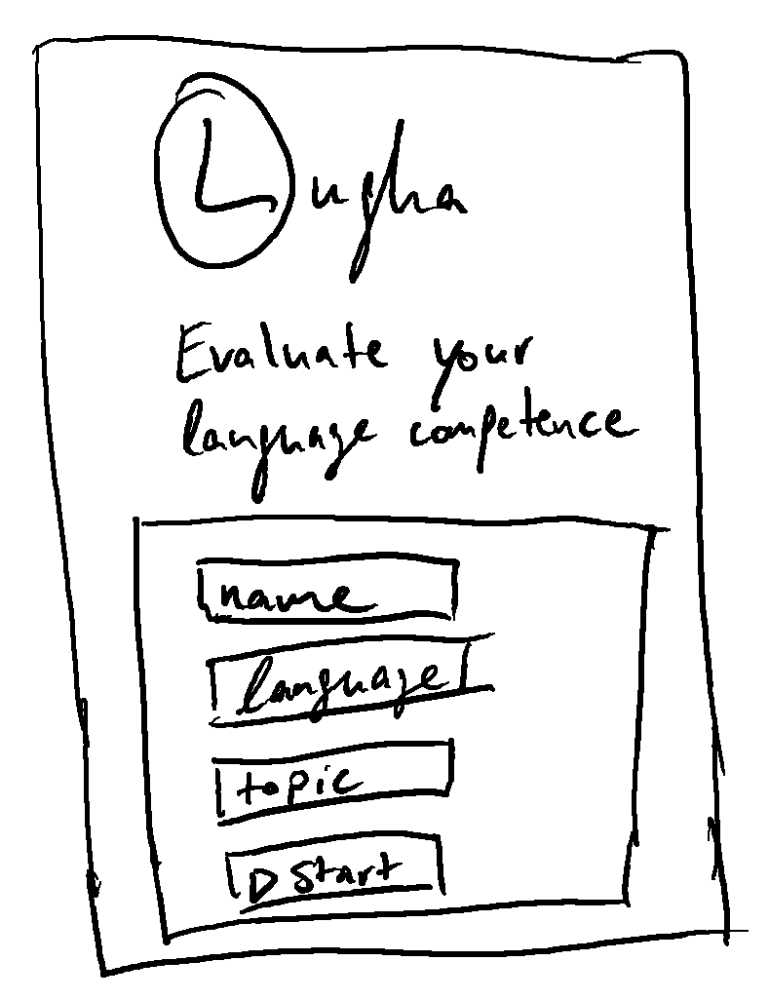
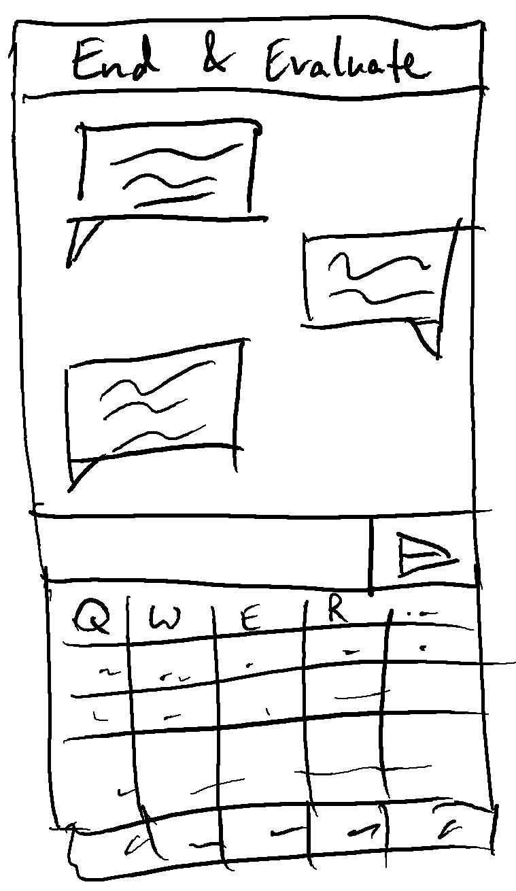
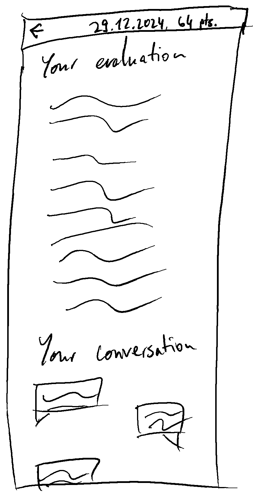
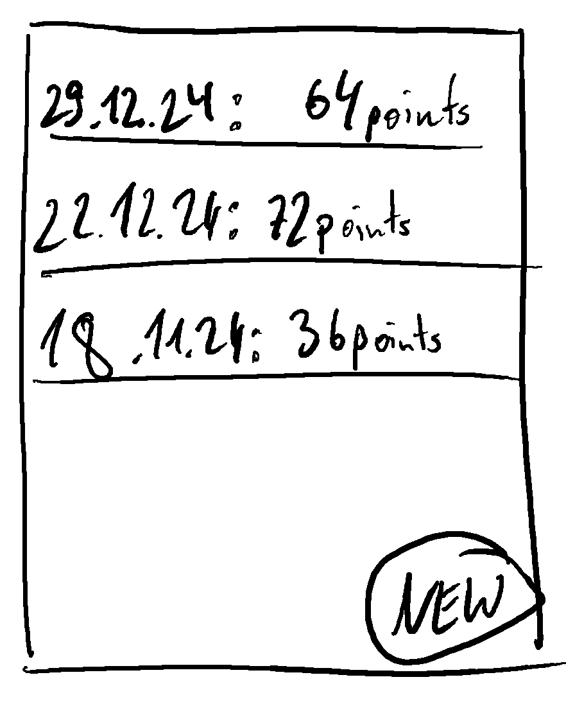
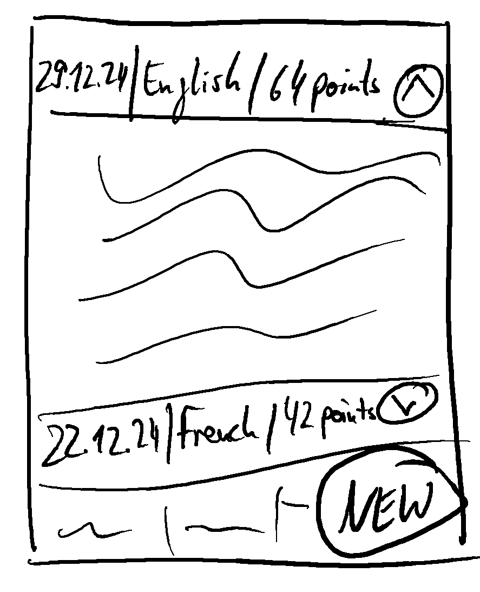
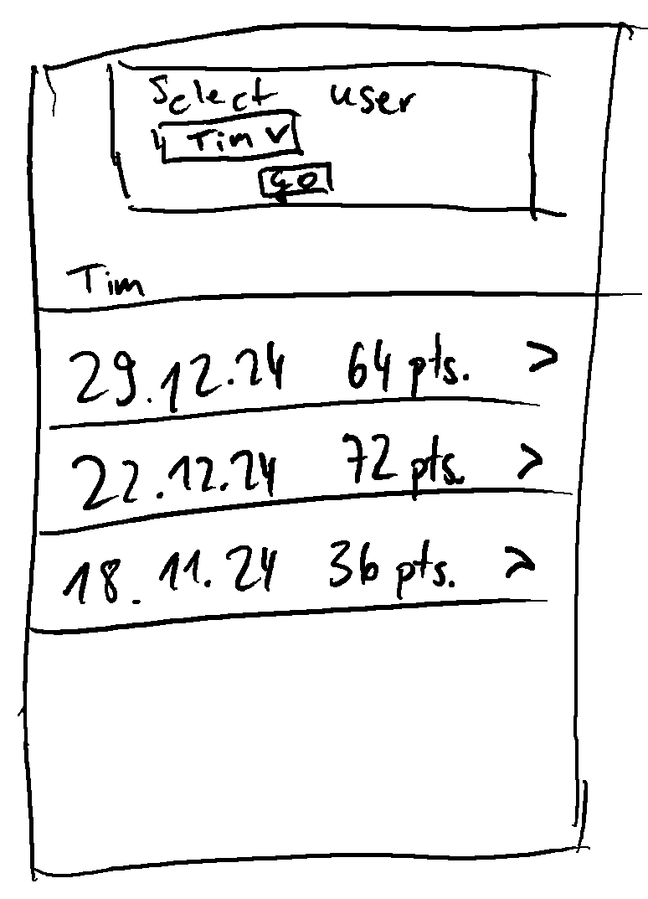

# The purpose of Lugha is to <b><u>evaluate language competence</u></b>

We believe that anybody can learn to speak
a language conversationally within 3 months.
This requires a high level of intensity & discipline.
By regularly evaluating your language competence,
you receive feedback quickly & speed up
your pace of learning. For additional accountability,
you can share access to your evaluations with others.

## Description

Lugha is a website where users can chat with an AI.
In a conversation format, a user sends written or
spoken text and receives a reply.
The chat interface is self-hosted
(and not e.g. served via Telegram or Facebook Messenger).
The UX is <b><u>optimised for a mobile experience</u></b>.
As AI, we currently use groq.com’s free LLM API.

Lugha has several frontend components:

- A welcome screen to set your language
& choose your learning mode
(Talk for immersive conversation,
 Learn for guided converstaion
 with translations and corrections).
- A chat screen for chatting.
- An evaluation screen for reading
  the AI’s language competence evaluation.
- A log screen to see past conversations
  & evaluations as well as summary statistics.
- A coach screen where past conversations
  & evaluations as well as summary
  statistics of a user can be shown.

### Welcome

A very simple screen with a few options.
Initially, set a name, choose a language, and select a mode.
Start the conversation.

### Chat

Total focus on the conversation itself.
There are only 2 options: 1) Send a message (send icon)
or 2) finish your conversation
& get an evaluation (top bar in red).

### Evaluation

After finishing a conversation,
see your evaluation and the now locked conversation.

A user can receive an evaluation only if the total number
of words sent by the user exceeds 10 words.
If this criterion isn't met, the user sees this friendly message:
*"Your conversation didn’t meet the criteria for evaluation.
Please send at least 10 words to receive a meaningful feedback."*

### Log

The log screen shows a list of past conversations.
Each conversation in that list shows the start_date of
that conversation, the language the user used and the overall score.

When a user clicks on a conversation,
an accordeon opens that shows the full evaluation that
the user received for that conversation.

On the log screen, when a user clicks on the “NEW” button in the
bottom right corner, the user can initiate a new conversation.

### Coach

The coach screen shows a dropdown where a coach
can select a user name, whose log is then shown.

## Monitoring: Uptime & usage KPIs

We need an easy-to-maintain and flexible set-up
to monitor uptime & usage. Initially (and maybe forever)
we’ll set up a Telegram webhook to periodically check
if the app is available. If it is unavailable,
it sends a Telegram message to the admins.
It also checks usage statistics. Once a week, it sends an
"I'm alive message" and provides summary statistics.

## Database design

The data is stored in a star schema model.

### conversations_sessions

- conversation_id (Primary Key)
- username
- created_at
- language
- mode
- start_time

### conversations_messages

- message_id (Primary Key)
- conversation_id (Foreign Key)
- created_at
- user_prompt
- bot_message

### conversations_evaluations

- evaluation_id (Primary Key)
- conversation_id (Foreign Key)
- created_at
- end_time
- evaluation
- interaction_count
- duration
