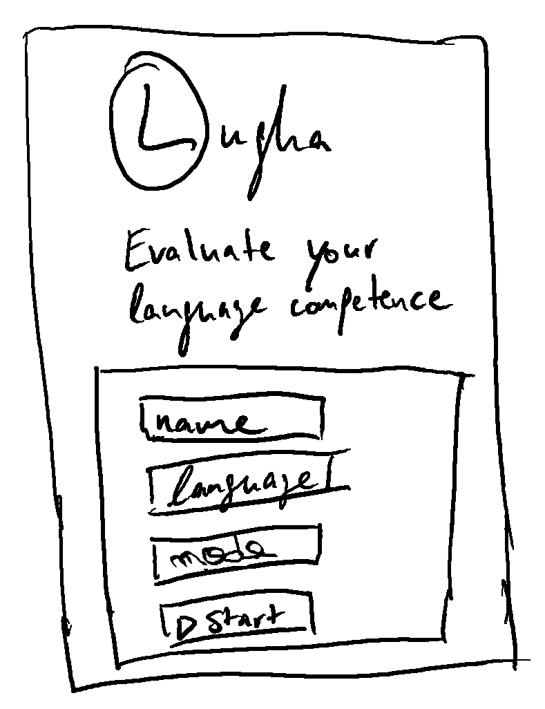

# The purpose of Lugha is to <b><u>evaluate language competence</u></b>

We believe that anybody can learn to speak
a language conversationally within 3 months.
This requires a high level of intensity & discipline.
By regularly evaluating your language competence,
you receive feedback quickly & speed up
your pace of learning. For additional accountability,
you can share access to your evaluations with others.

## Description

Lugha is a website where users can chat with an AI.
In a conversation format, a user sends written or
spoken text and receives a reply.
The chat interface is self-hosted
(and not e.g. served via Telegram or Facebook Messenger).
The UX is <b><u>optimised for a mobile experience</u></b>.
As AI, we currently use groq.com’s free LLM API.

Lugha has several frontend components:

- A welcome screen to set your language
  and conversation topic.
- A chat screen for chatting.
- An evaluation screen for reading
  the AI’s language competence evaluation.
- A log screen to see past conversations
  & evaluations as well as summary statistics.
- A coach screen where past conversations
  & evaluations as well as summary
  statistics of a user can be shown.

### Welcome

Very simple screen with few options.
Initially, set a name, a language and a theme.
Start the conversation.

### Chat

Total focus on the conversation itself.
There are only 2 options: 1) Send a message (send icon)
or 2) finish your conversation
& get an evaluation (top bar in red).

### Evaluation

After finishing a conversation,
see your evaluation and the now locked conversation.

### Log

The log screen shows a full list of all past
(now locked) conversations and their evaluations
(see evaluation screen). A user can initiate
a new conversation here. When he clicks “NEW”,
the user sees the screen “When ‘Chat’ is clicked”.
[HOW WILL CHANGES OVER TIME BE VISUALISED?
E.G. VIA BUTTON TO DEPICT GRAPHS ON THE BOTTOM LEFT?]

### Coach

The coach screen shows a dropdown where a coach
can select a user name, whose log is then shown.

## Monitoring: Uptime & usage KPIs

We need an easy-to-maintain and flexible set-up
to monitor uptime & usage. Initially (and maybe forever)
we’ll set up a Telegram webhook to periodically check
if the app is available. If it is unavailable,
it sends a Telegram message to the admins.
It also checks usage statistics. Once a week, it sends an
"I'm alive message" and provides summary statistics.
